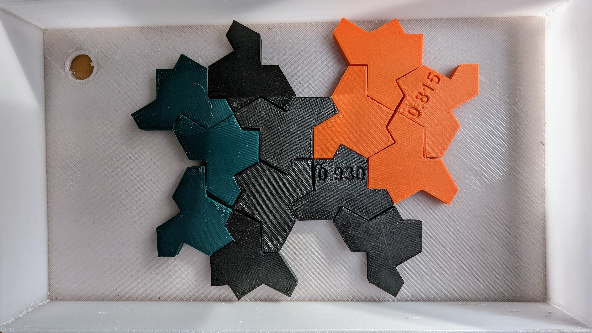
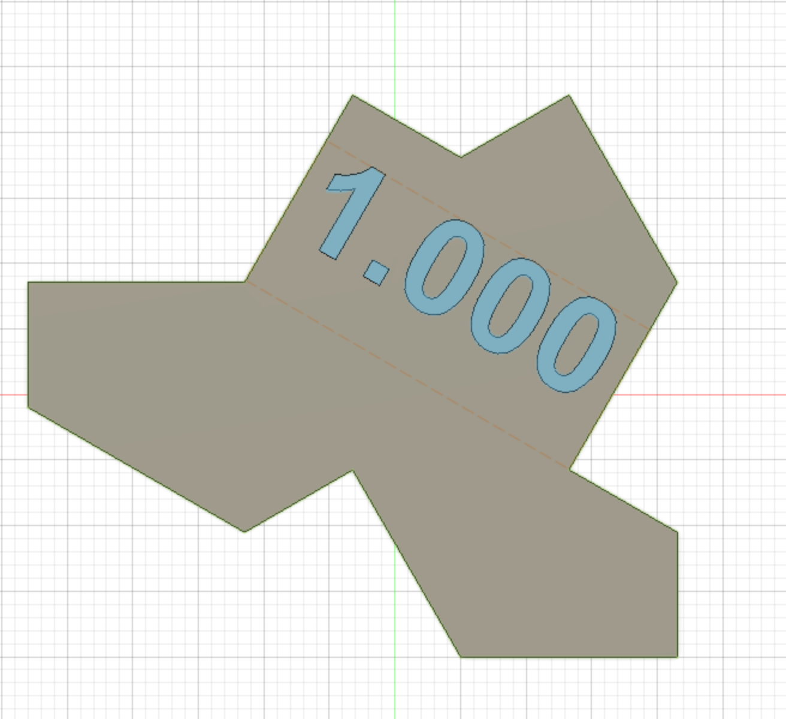
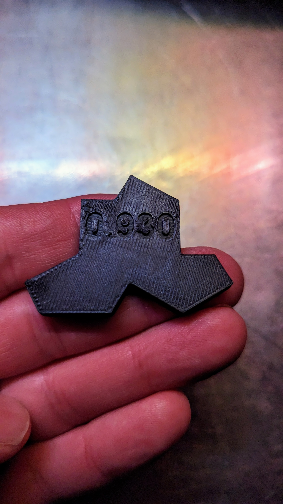
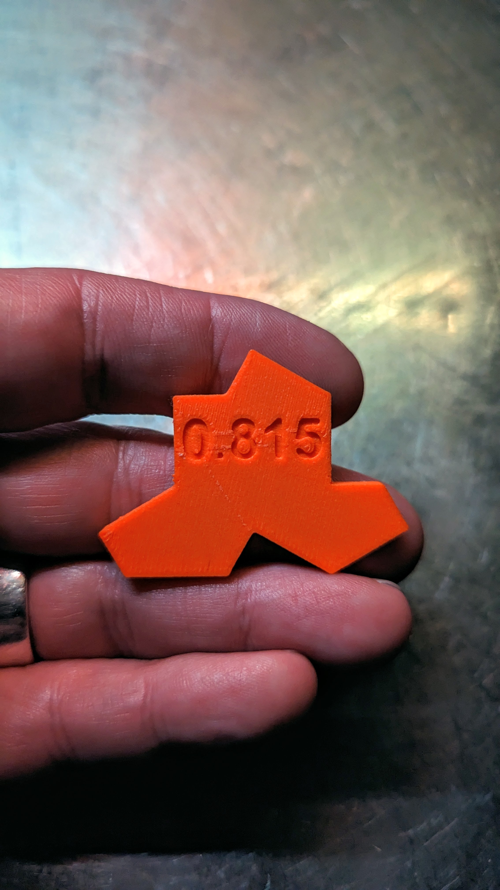

# Filament Tuning - Extrusion Multiplier
I've been using the AndrewEllis93 [guide for tuning Extrusion Multiplier](https://ellis3dp.com/Print-Tuning-Guide/articles/extrusion_multiplier.html) to help get each filament's flow dialed in for top-quality prints. This process works really well (along with much of his other tuning advice), but due to the trial and error nature of the process I'd found that I ended up generating between 5 and 30ish printed tiles for each filament - all but a few destined for the trash.  

Here's an alternative tile shape, and recent [mathematical discovery](#the-hat---an-aperiodic-monotile), that you can use for tuning, reference, and collecting! It makes for a fun activity for those into creating tiled patterns, especially as your color collection grows!

## Print Settings
This is a 3mm tall tile. If you feel like adjusting layer heights from default, just make sure you have at least 2 layers of infill between bottom and top layers. Check out guidance in the [Print Settings](https://ellis3dp.com/Print-Tuning-Guide/articles/extrusion_multiplier.html#print-settings) section of the Ellis' Print Tuning guide for additional detail.

### Defaults for a .4mm nozzle
* 30% infill
* .25 mm first layer
* .20 mm layer height thereafter
* 2 bottom layers
* 3 top layers
* Top Infill pattern Monotonic (filled) infill pattern

Follow the rest of the [steps](https://ellis3dp.com/Print-Tuning-Guide/articles/extrusion_multiplier.html#steps) outlined in the tuning guide, matching the Extrusion Multiplier setting with number on the tile for future reference. As an example, if you want to test extrusion multipliers of 99%, 98%, 97% you would drop the [99-0.stl](./STLs/99-0.stl), [98-0.stl](./STLs/98-0.stl), and [97-0.stl](./STLs/97-0.stl) tile into your slicer, and configrue each object with the appropriate Extrusion Multiplier setting.

Before printing, don't forget to:
* Set your default Extrusion Multiplier to 1.0 or 100% 
* Enable sequential printing (complete individual objects) if printing several tests at one time

### For SuperSlicer Users
I've exported a [plate](./STLs/OneStone-Full-Plate.3mf) that contains all of the tiles with matching extrusion multiplier settings. I'm not sure how many other settings this exports, but hopefully it's helpful to others.

## The Hat - An Aperiodic Monotile
On March 23rd 2023, I'd stumbled across [this discovery](https://www.nytimes.com/2023/03/28/science/mathematics-tiling-einstein.html) in my mornign news feed. A mathematical breakthrough in the form of a 13-sided shape called [The Hat](https://cs.uwaterloo.ca/~csk/hat/). It's a 13 sided shape that can tile a plane, but never repeat. This shape has been eluding mathematicians for over 60 years, and until this example was created it wasn't clear that an object with such properties even existed!  

### Additional information on 'The Hat'
* The scientific paper with all the details: [An aperiodic monotile](https://cs.uwaterloo.ca/~csk/hat/)
* Source files [GitHub - christianp/aperiodic-monotile: Smith, Myers, Kaplan and Goodman-Strauss's aperiodic monotile, in a variety of formats](https://github.com/christianp/aperiodic-monotile)
* Play with the shape on [Mathigon](https://mathigon.org/polypad/YBnO3csAjpKWCg)

## Additional Images

